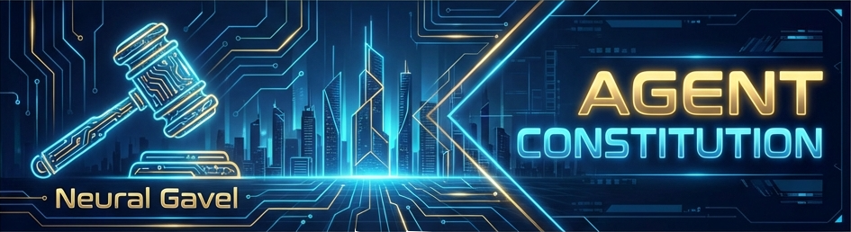

<div align="center">



<h1>قانون اساسی ایجنت 📜</h1>

<p align="center">
  <a href="https://github.com/su6i/agent-constitution/blob/main/LICENSE"></a>
  <a href="#"></a>
  <a href=".cursor/workflows/documentation.md"></a>
  <a href="https://linkedin.com/in/su6i"></a>
</p>

<strong>معماری زمینه‌ای تأییدشده برای ایجنت‌های هوش مصنوعی</strong>

</div>

---

[🇬🇧 English Version](README.md)

---

## 🤥 مشکل

اکثر ایجنت‌های هوش مصنوعی (Cursor، AntiGravity، Windsurf، Copilot) به دلیل ساختار نداشتن «حافظه» شکست می‌خورند.
به آن‌ها یک پرامپت ۵۰ صفحه‌ای بدهید، توهم می‌زنند. به آن‌ها هیچ ندهید، کد اسپاگتی می‌نویسند.
ما به یک حد وسط نیاز داشتیم: یک «قانون اساسی» سخت‌گیرانه و ماژولار که ایجنت‌ها را مجبور کند مثل مهندسان ارشد رفتار کنند.

---

## ⚡ راه‌حل: معماری زمینه‌ای

این مخزن فقط «قوانین» نیست. این یک **معماری زمینه‌ای ماژولار** است.
چرخه حیات نرم‌افزار را به ۵ اتم پیوندی تجزیه می‌کند. ایجنت فقط آنچه نیاز دارد را بارگذاری می‌کند، زمانی که نیاز دارد.

### ویژگی‌های اصلی
- 🔨 **چماق عصبی:** یک روتر `.cursorrules` سخت‌گیرانه که ایجنت را از حدس زدن باز می‌دارد.
- 🧰 **حافظه ماژولار:** گردش‌کارها برای Init، Docs، AI و QA جدا هستند تا از خطاهای "گم‌شدن در میانه" جلوگیری شود.
- 🎭 **پروتکل حقیقت:** ایجنت‌ها از علامت‌گذاری وظایف به عنوان "انجام‌شده" بدون تأیید `ls -R` منع شده‌اند.

---

## 🚀 شروع سریع

### نصب (یک‌خطی)
```bash
curl -sL https://raw.githubusercontent.com/su6i/agent-constitution/main/install.sh | bash
```

### نصب دستی
```bash
git clone https://github.com/su6i/agent-constitution.git
cd agent-constitution
./bin/scaffold.sh /path/to/your/project
```

---

## 📂 ساختار پروژه

```text
agent-constitution/
├── .cursor/
│   ├── rules/          # قوانین جهانی
│   ├── workflows/      # گردش‌کارها
│   ├── prompts/        # قالب‌های پرامپت
│   └── skills/         # ۵۸ مهارت فنی
├── assets/             # دارایی‌های بصری
├── bin/                # اسکریپت‌های اجرایی
├── CONTRIBUTING.md     # راهنمای مشارکت
├── CHANGELOG.md        # تاریخچه تغییرات
└── README.md           # مستندات اصلی
```

---

## 🧠 مهارت‌ها

این مخزن شامل **۵۸ مهارت فنی** در زمینه‌های زیر است:

### توسعه نرم‌افزار
- Python، JavaScript/TypeScript، SwiftUI، Jetpack Compose
- FastAPI، Flask، Modern Web UI

### هوش مصنوعی و یادگیری ماشین
- LLM Engineering، RAG، Reinforcement Learning
- PyTorch، Scikit-learn، DSPy

### علم داده
- Polars، DuckDB، Pandas
- Financial Data Science

### اتوماسیون خلاقانه
- Manim، Blender، DaVinci Resolve
- FFmpeg، ImageMagick

### زیرساخت
- Kubernetes، Docker، GitHub Actions
- Linux، CUDA، macOS Automation

---

## 🤝 مشارکت

مشارکت‌های شما خوش‌آمد است!
لطفاً قبل از ارسال Pull Request، فایل [CONTRIBUTING.md](CONTRIBUTING.md) را مطالعه کنید.

---

## 📝 لایسنس

این پروژه تحت لایسنس [MIT](LICENSE) منتشر شده است.

---

## 📞 ارتباط

- **لینکدین:** [su6i](https://linkedin.com/in/su6i)
- **گیت‌هاب:** [su6i](https://github.com/su6i)

---

<div align="center">

ساخته شده با ❤️ توسط مهندسانی که از کدهای AI-generated خسته شده بودند.

</div>
