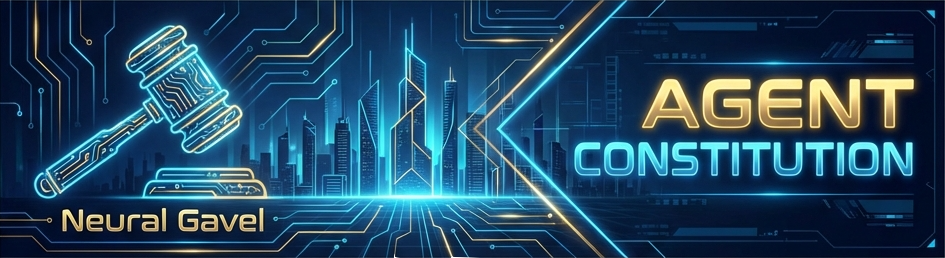
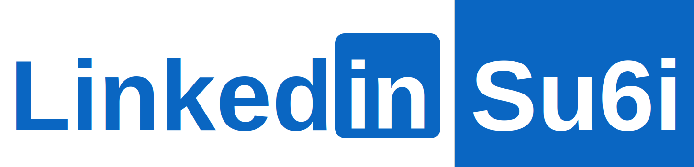

<div align="center">
  
  <h1>Agent Constitution 📜</h1>
  
  <!-- Custom LinkedIn Badge -->
  <!-- ACTION: Replace 'su6i' with your own ID and 'linkedin_su6i.svg' with your own asset -->
  <a href="https://img.shields.io/badge/License-MIT-green.svg"></a><a href="https://img.shields.io/badge/Status-Active-blue.svg"></a><a href="workflows/documentation.md"></a><a href="https://linkedin.com/in/su6i"></a>
  <br><br><strong>The Validated Context Architecture for AI Agents.</strong>
</div>

---

## 🏗 The Problem
Most AI Agents (Cursor, AntiGravity, Windsurf, Copilot) fail because their "memory" is unstructured. You give them a 50-page prompt, they hallucinate. You give them nothing, they write spaghetti code.
**We needed a middle ground: A strict, modular "Constitution" that forces Agents to behave like Senior Engineers.**

## ⚡ The Solution: Context Architecture
This repository is not just "rules". It is a **Modular Context Architecture**.
It breaks down the software lifecycle into 5 atomic, linked workflows. The Agent loads *only* what it needs, when it needs it.

### Core Features 
- **⚖️ The Neural Gavel:** A strict `.cursorrules` router that prevents the Agent from guessing.
- **🧠 Modular Memory:** Workflows for Init, Docs, AI, and QA are split to prevent "Lost-in-the-Middle" errors.
- **🛡️ Truth Protocol:** Agents are forbidden from marking tasks "Done" without `ls -R` verification.
- **🤖 Anti-Hallucination:** Strict file collision and deletion safety protocols.

## 🚀 Quick Start

### Option A: Automated Scaffolding (Recommended)
1.  **Install the Scaffolder:**
    ```bash
    # Add this alias to your shell config (~/.zshrc)
    alias init-gh='~/path/to/agent-constitution/bin/scaffold.sh'
    ```
2.  **Run in any new project:**
    ```bash
    mkdir my-new-project && cd my-new-project
    init-gh
    ```
    *Result: The `.cursorrules`, `workflows/`, and `prompts/` are injected and committed automatically.*

### Option B: Manual Setup
1.  Clone this repo.
2.  Copy `.cursorrules`, `workflows/`, and `prompts/` to your project root.
3.  **Ask your Agent:**
    > "Audit my codebase against the Quality Assurance protocol."

## 📚 Documentation
- **[Init Workflow](workflows/init-project.md):** How to start clean.
- **[AI Logic](workflows/ai-optimization.md):** Architect vs Executor models.
- **[QA Protocol](workflows/quality-assurance.md):** Zero-bug policy.

---
*Built with strict adherence to the Prompt-Driven Development methodology.*
